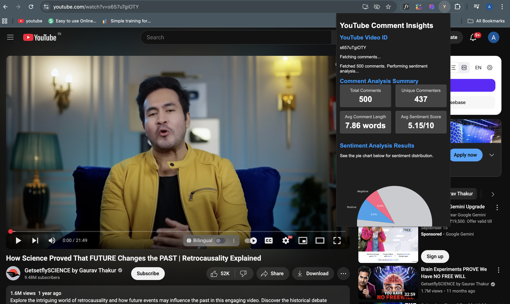
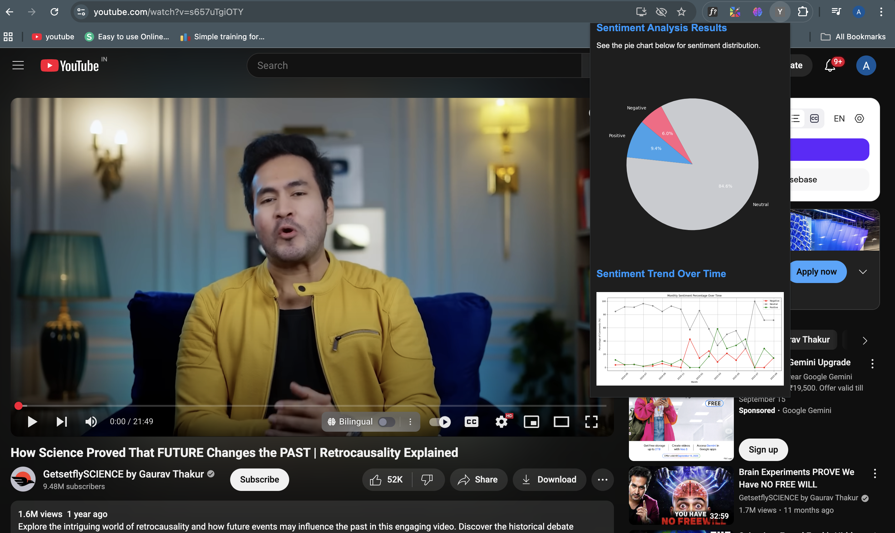
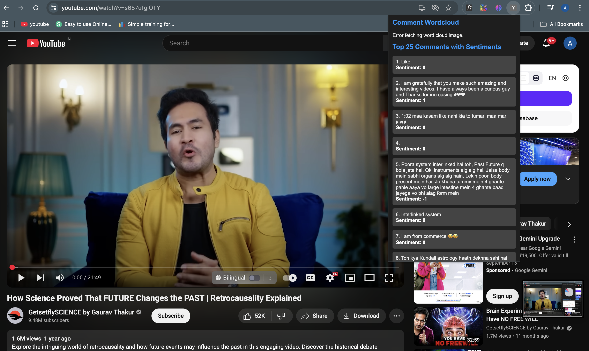

# 🎬 End-to-End YouTube Sentiment Analysis  

A complete end-to-end **Machine Learning + MLOps project** that analyzes YouTube video comments and classifies them into **Positive, Negative, or Neutral** sentiments.  

The project involves **data preprocessing, model training, hyperparameter tuning, tracking experiments, deployment with Flask API, and CI/CD pipeline on AWS with Docker and GitHub Actions**.  

---

## 📌 Project Overview  
- ✅ Scraped & used **Reddit comment dataset** for training  
- ✅ Data cleaning & preprocessing (stopwords removal, lemmatization, etc.)  
- ✅ Handled **imbalanced dataset** with **SMOTE oversampling**  
- ✅ Feature extraction using **Bag of Words (BoW)** and **TF-IDF with n-grams (trigrams)**  
- ✅ Model training with multiple algorithms:
  - RandomForest → 64% accuracy  
  - XGBoost + Optuna (hyperparameter tuning) → 75% accuracy  
  - LightGBM (with trigrams) → **81% accuracy**  
  
## 📊 Model Performance

| Class         | Precision | Recall | F1-Score | Support |
|---------------|-----------|--------|----------|---------|
| Negative (-1) | 0.79      | 0.78   | 0.79     | 1647    |
| Neutral (0)   | 0.86      | 0.95   | 0.91     | 2510    |
| Positive (1)  | 0.91      | 0.84   | 0.88     | 3176    |
| **Accuracy**  |           |        | **0.87** | **7333**|
| **Macro Avg** | 0.86      | 0.86   | 0.86     | 7333    |
| **Weighted Avg** | 0.87   | 0.87   | 0.87     | 7333    |


- ✅ Experiment tracking with **MLflow**  
- ✅ Built a **Chrome Extension** to analyze YouTube comments in real-time  
- ✅ Exposed prediction service via **Flask REST API**  
- ✅ Deployed on **AWS EC2 using Docker + GitHub Actions CI/CD**  

---

## 🚀 Tech Stack
- **Python** (3.11)  
- **Flask API**  
- **ML Models:** RandomForest, XGBoost, LightGBM  
- **NLP:** Scikit-learn (TF-IDF, BoW)  
- **Data Handling:** Pandas, Numpy  
- **Hyperparameter Tuning:** Optuna  
- **Experiment Tracking:** MLflow  
- **Deployment:** AWS (EC2, ECR), Docker, GitHub Actions  
- **Extension:** Chrome Extension with YouTube API  

---

## ⚙️ Setup Instructions  

### 1️⃣ Create Environment  
```bash
conda create -n youtube python=3.11 -y
```
```bash 
conda activate youtube
````
```bash
pip install -r requirements.txt
```

### DVC Pipeline (if dataset tracked with DVC)

```bash
dvc init
```
```bash
dvc repro
```
### Run Flask API Locally

```bash
python flask_app/app.py
```

## 🎯 Chrome Extension

- Load the extension in Chrome:
- Go to chrome://extensions
- Enable Developer Mode
- Click Load unpacked → Select the extension folder
- Get YouTube API Key:
- Use the extension → analyze comments sentiment directly on YouTube 🎬


---

## ⚙️ CI/CD Workflow  

1. **GitHub Actions builds Docker image**  
2. **Pushes to Amazon ECR**  
3. **EC2 self-hosted runner pulls image from ECR**  
4. **Launches Flask API container**  

---

## 📊 Results  

- ✅ Best model: **LightGBM with trigrams**  
- ✅ Accuracy: **87%**  
- ✅ Integrated into **real-time Chrome extension** for YouTube comments  

---

## 📷 Demo Screenshots  

### 🔹 Chrome Extension Popup




---

## 📌 Future Improvements  

- 🔹 Fine-tune model with transformer-based architectures (**BERT, DistilBERT**)  
- 🔹 Deploy on **AWS Lambda + API Gateway** for serverless usage  
- 🔹 Add **real-time dashboards** with Streamlit for monitoring  

---

## 👨‍💻 Author  

**Akshat Pratap Singh**  
🔗 [LinkedIn](#) | [GitHub](https://github.com/Akshat48002)  

---

